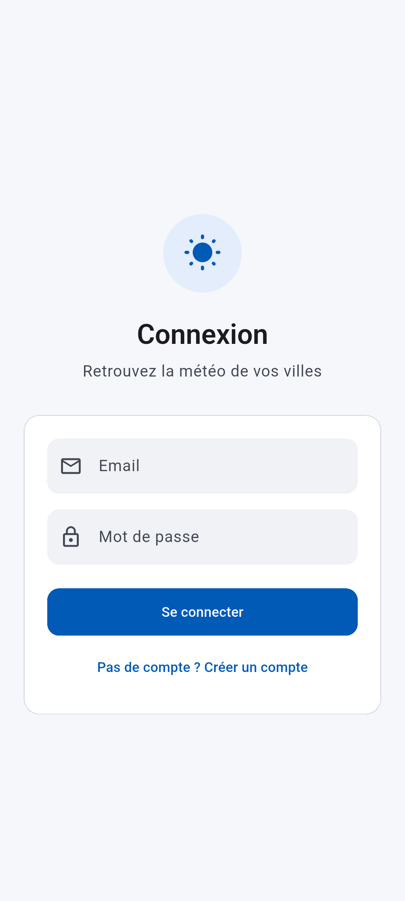
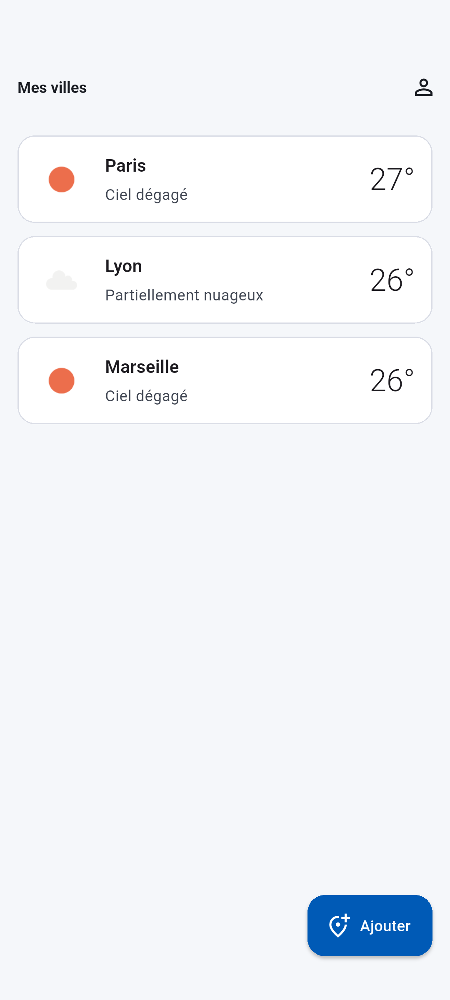
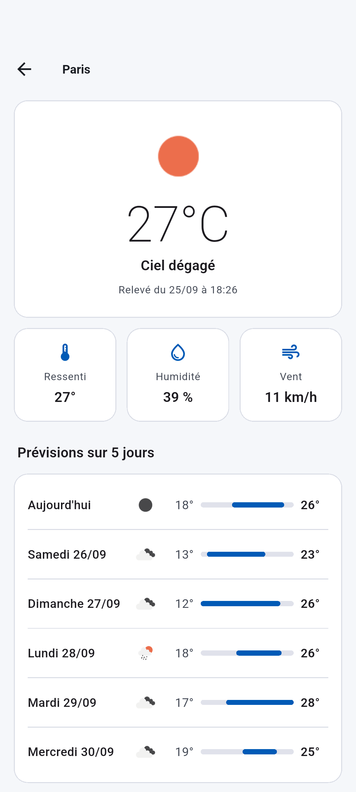
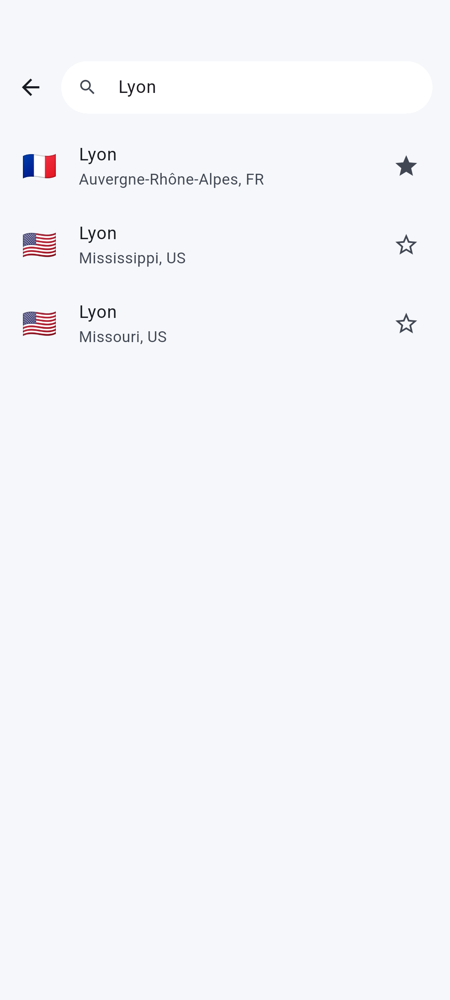
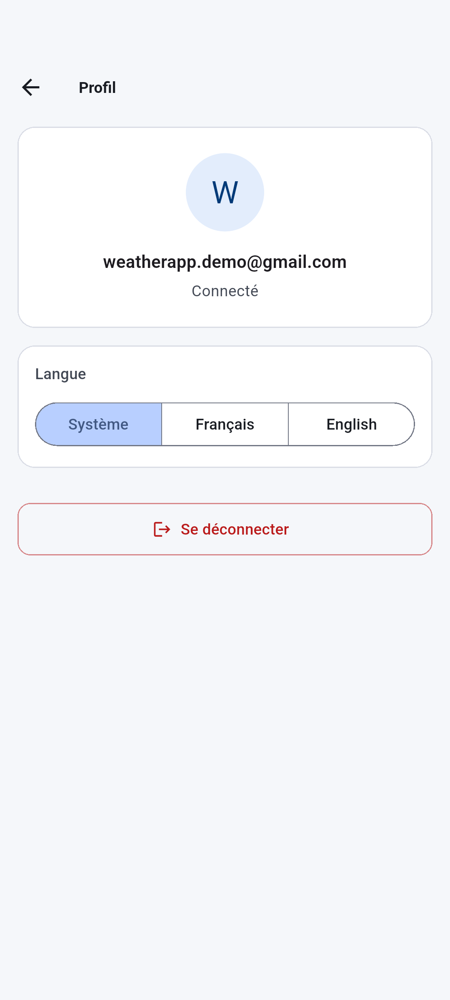

# Météo — Flutter, Supabase et OpenWeatherMap

[](https://github.com/Aristofane1/weather-app-nextflutter/actions/workflows/ci.yml)


App météo offline-first : authentification JWT (Supabase), villes favorites synchronisées, météo actuelle et prévisions à 5 jours (OpenWeatherMap), cache local Hive.

## Fonctionnalités

- Inscription, connexion et déconnexion (Supabase Auth, JWT et refresh token)
- Écrans : **Mes villes** (favoris et température), **Détail** (météo actuelle et prévisions à 5 jours), **Recherche** (geocoding et ajout aux favoris), **Profil**
- **Offline-first** : les données en cache s'affichent immédiatement, puis sont mises à jour depuis le réseau. Hors ligne, les dernières données en cache restent affichées.
- Messages d'erreur réseau en français ou en anglais et bouton « Réessayer »
- Skeleton loaders (shimmer) pendant les chargements
- **Internationalisation FR / EN** : langue de l'appareil par défaut, sélecteur dans Profil (Système / Français / English), descriptions météo OpenWeatherMap dans la langue choisie
- **Accessibilité** : tuiles ville lues en une phrase, état « favori » exposé au lecteur d'écran, chargements annoncés
- Icônes météo mises en cache sur disque (`cached_network_image`)

## Captures

Captures réelles : émulateur Android (API 34), app en français, données en direct de Supabase et OpenWeatherMap.

<table>
  <tr>
    <th>Connexion</th>
    <th>Mes villes</th>
    <th>Détail</th>
  </tr>
  <tr>
    <td></td>
    <td></td>
    <td></td>
  </tr>
  <tr>
    <th>Recherche</th>
    <th>Profil</th>
    <th></th>
  </tr>
  <tr>
    <td></td>
    <td></td>
    <td></td>
  </tr>
</table>

<details>
<summary>Régénérer les captures</summary>

Le parcours `tool/screenshots/tour.dart` pilote la vraie app avec `flutter drive`, et `tool/screenshots/driver.dart` enregistre les PNG dans `screenshots/`. Il faut un émulateur ou un appareil Android en français, et un compte Supabase de démo :

```bash
flutter drive \
  --driver=tool/screenshots/driver.dart \
  --target=tool/screenshots/tour.dart \
  -d <device-id> \
  --dart-define=DEMO_EMAIL=<email> \
  --dart-define=DEMO_PASSWORD=<mot-de-passe>
```
</details>

## Architecture

Organisation feature-first, avec un découpage `data / domain / presentation` dans chaque feature.

```
lib/
  app/        routeur go_router (redirection selon l'état d'auth), MaterialApp
  core/       socle réutilisable, indépendant des features
    config/       Env (.env)
    network/      AuthInterceptor, OwmInterceptor, NetworkInfo
    error/        Failure (union freezed) + mapping DioException → Failure
    result/       Result<T> = Success | Failed
    cache/        CacheStore / HiveCacheStore
    storage/      AuthSession + SessionStorage (flutter_secure_storage)
    repository/   BaseRepository : offlineFirst() et guard()
    settings/     SettingsStore (Hive box `settings`) et LocaleController (langue choisie)
    widgets/      ResultView, Skeleton*, ErrorView, EmptyView, ScrollableFill
  features/
    auth/     Supabase Auth (GoTrue REST)
    weather/  météo actuelle et prévisions (OpenWeatherMap)
    cities/   recherche (OWM geocoding) et favoris (Supabase PostgREST)
  l10n/       fichiers ARB (app_fr.arb, app_en.arb) et code généré (flutter gen-l10n)
integration_test/
  app_test.dart       test unique : parcours complet de l'app (voir section Tests)
  support/            fakes et harness de montage de l'app
```

**Flux de données :** Widget → provider Riverpod → interface `Repository` (domain) → `RepositoryImpl` (data) → `RemoteDataSource` (Dio) + `CacheStore` (Hive)

- **Repository pattern :** l'UI ne dépend que des interfaces du domaine. Les implémentations renvoient `Result<T>` et ne lèvent jamais d'exception.
- **Offline-first** (`BaseRepository.offlineFirst`) :
  1. Le cache est émis s'il existe.
  2. Hors ligne, on s'arrête là. Sans cache, on émet `Failure.network`.
  3. En ligne, on appelle l'API, on écrit le résultat dans le cache et on émet la donnée fraîche. Si l'appel échoue alors qu'un cache existe, les données en cache restent affichées.
  4. Le cache n'est pas cloisonné par utilisateur : il est vidé à la déconnexion, à l'expiration de la session et à chaque connexion, pour qu'un utilisateur ne voie jamais les données du précédent.
- **Auth :**
  - Il y a deux clients Dio Supabase. Le client *auth* (login, signup, refresh) n'a pas d'intercepteur. Le client *données* porte l'`AuthInterceptor`.
  - L'intercepteur injecte `Authorization: Bearer <jwt>`. Il rafraîchit le token préventivement quand il est expiré, et aussi sur une 401. C'est un `QueuedInterceptor` : les 401 concurrents partagent un seul refresh, puis les requêtes sont rejouées via un `retryDio` séparé (sans `AuthInterceptor`), avec le nouveau Bearer explicite — rejouer via le Dio intercepté bloquait sa file d'erreurs quand la requête rejouée renvoyait aussi 401.
  - Si le refresh token est refusé, la session et le cache sont effacés (`AuthRepository.clearLocalData`) et l'utilisateur est renvoyé au login ; une requête dont le refresh préventif est refusé échoue en 401 au lieu de partir sans token. En cas d'erreur réseau, la session est conservée (offline-first).
  - `signOut` est best-effort : l'appel réseau et chaque nettoyage local (session, cache) sont isolés par try/catch, pour qu'il se termine toujours, même si l'un d'eux échoue.
- **Sérialisation :** DTO `freezed` + `json_serializable`. Le JSON brut de l'API est mis en cache et re-parsé à la lecture. Une entrée devenue illisible est supprimée.

## APIs utilisées

| API | Usage | Endpoints |
|---|---|---|
| Supabase Auth | inscription, connexion, refresh, logout | `/auth/v1/signup`, `/auth/v1/token?grant_type=password\|refresh_token`, `/auth/v1/logout` |
| Supabase PostgREST | villes favorites (RLS par utilisateur) | `/rest/v1/favorite_cities` |
| OpenWeatherMap | météo actuelle, prévisions 5 j / 3 h, geocoding | `/data/2.5/weather`, `/data/2.5/forecast`, `/geo/1.0/direct` |

## Configuration

1. **Prérequis :** Flutter 3.41+ (Dart 3.11).
2. **Supabase :**
   - Créez un projet sur [supabase.com](https://supabase.com).
   - Dans **SQL Editor**, exécutez [`supabase/schema.sql`](supabase/schema.sql).
   - Récupérez `Project URL` et la clé `anon` dans **Project Settings → API**.
   - Facultatif : désactivez **Authentication → Providers → Email → Confirm email** pour tester sans confirmation d'email.
3. **OpenWeatherMap :** créez une clé gratuite sur [openweathermap.org](https://home.openweathermap.org/api_keys). L'activation peut prendre jusqu'à 2 h.
4. **Variables d'environnement :**
   ```bash
   cp .env.example .env   # puis renseigner les 3 valeurs
   ```
   Le fichier `.env` est déclaré comme asset (obligatoire pour compiler) et n'est jamais commité. S'il est absent ou incomplet au lancement, l'app affiche un écran « Configuration invalide ».

   `.env` est embarqué dans l'APK : la clé OWM est extractible (usage démo) ; la clé anon Supabase est publique par conception, les données sont protégées par la RLS.

## Lancer

```bash
cp .env.example .env
flutter pub get
dart run build_runner build
flutter run
```

## Internationalisation

- Fichiers ARB dans `lib/l10n/` : `app_fr.arb` (français) et `app_en.arb` (anglais, gabarit `l10n.yaml`). Le code (`AppLocalizations`) est généré par :
  ```bash
  flutter gen-l10n
  ```
- **Ajouter une clé :** l'ajouter dans les deux fichiers ARB (`app_fr.arb` et `app_en.arb`), régénérer avec `flutter gen-l10n`, puis l'utiliser via `context.l10n.maCle`.
- **Langue :** celle de l'appareil par défaut. Sélecteur **Système / Français / English** dans Profil, mémorisé dans la box Hive `settings` (`core/settings/`).
- Le paramètre `lang` envoyé à OpenWeatherMap suit la locale effective (appareil ou choix explicite), pour que les descriptions météo soient dans la même langue que l'UI.
- Changer de langue relance les requêtes météo : les descriptions OWM suivent immédiatement.

## Performance

- Les listes utilisent `ListView.builder` / `separated` : les éléments (et leurs images) ne sont construits qu'à l'approche de l'écran.
- Icônes météo en `cached_network_image`, avec `memCacheWidth` calculé à la taille affichée (× `devicePixelRatio`) pour éviter de décoder des images plus grandes que nécessaire ; cache disque inclus. Le `CacheManager` est injecté via `iconCacheManagerProvider`, `null` dans les tests (pas d'accès réseau).
- Rebuilds réduits : `const` partout où c'est possible (lint `prefer_const_constructors` actif), `ref.watch(provider.select(...))` côté Profil, `RepaintBoundary` autour des skeletons pour isoler l'animation shimmer du reste de l'écran.


## Tests

| Type | Nombre | Emplacement |
|---|---|---|
| Unitaires | 78 | `test/` (`test(`) |
| Widget | 24 | `test/` (`testWidgets(`) |
| Intégration | 1 | `integration_test/app_test.dart` (`testWidgets(`) |

```bash
flutter test                                    # unitaires + widget
flutter test integration_test                   # intégration, sur appareil / émulateur
```

Le test d'intégration unique (`integration_test/app_test.dart`) rejoue le parcours complet — connexion, ajout d'une ville, détail, déconnexion — sur les repositories factices de `integration_test/support/` (`fakes.dart`, `app_harness.dart`), sans réseau ni clés API.

## CI/CD

Workflow GitHub Actions [`ci.yml`](.github/workflows/ci.yml), déclenché sur `push`, `pull_request` et manuellement (`workflow_dispatch`) :

| Job | Rôle |
|---|---|
| `analyze-test` | `flutter analyze` + `flutter test --coverage`, coverage publiée en artifact |
| `integration` | `flutter test integration_test` sur un émulateur Android (KVM, API 34) |
| `build-apk` | build d'un APK debug (uniquement sur `main`, après `analyze-test`), publié en artifact `app-debug-apk` |

Chaque job commence par `cp .env.example .env` : ce fichier ne doit contenir que des valeurs d'exemple, jamais de vraies clés (exigence de sécurité, en plus du `.gitignore`).

## Changelog

Voir [`CHANGELOG.md`](CHANGELOG.md).
